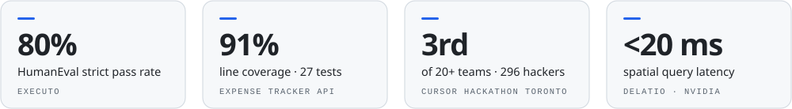

<a href="https://hosseingorji05.github.io/Portfolio/">
<picture>
  <source media="(prefers-color-scheme: dark)" srcset="assets/banner-dark.svg" />
  
</picture>
</a>

  
  
  
  

### <samp>~/about</samp>

Full-stack developer and 3rd-year Computer Science student who ships **tested, production-shaped software** for real clients — and builds applied-AI systems with **real guardrails around model output**. Comfortable owning a feature end-to-end: requirements, build, testing, deployment, and explaining the technical calls to non-technical stakeholders.

<picture>
  <source media="(prefers-color-scheme: dark)" srcset="assets/metrics-dark.svg" />
  
</picture>

 <samp>B.Sc. Honours Computer Science · York University · expected May 2028</samp> <samp>English (full) · Persian (fluent) &nbsp;·&nbsp; <a href="mailto:hoseingorji1383@gmail.com">hoseingorji1383@gmail.com</a></samp>

<picture>
  <source media="(prefers-color-scheme: dark)" srcset="assets/divider-dark.svg" />
  
</picture>

### <samp>~/stack</samp>

<table>
<tr>
<td valign="middle"><samp><b>LANGUAGES</b></samp></td>
<td align="center" width="72">
<picture>
  <source media="(prefers-color-scheme: dark)" srcset="https://skillicons.dev/icons?i=java&theme=dark" />
  
</picture> Java
</td>
<td align="center" width="72">
<picture>
  <source media="(prefers-color-scheme: dark)" srcset="https://skillicons.dev/icons?i=js&theme=dark" />
  
</picture> JavaScript
</td>
<td align="center" width="72">
<picture>
  <source media="(prefers-color-scheme: dark)" srcset="https://skillicons.dev/icons?i=ts&theme=dark" />
  
</picture> TypeScript
</td>
<td align="center" width="72">
<picture>
  <source media="(prefers-color-scheme: dark)" srcset="https://skillicons.dev/icons?i=python&theme=dark" />
  
</picture> Python
</td>
<td align="center" width="72">
<picture>
  <source media="(prefers-color-scheme: dark)" srcset="https://skillicons.dev/icons?i=c&theme=dark" />
  
</picture> C
</td>
<td align="center" width="72">
<picture>
  <source media="(prefers-color-scheme: dark)" srcset="https://skillicons.dev/icons?i=bash&theme=dark" />
  
</picture> Bash
</td>
<td align="center" width="72">
<picture>
  <source media="(prefers-color-scheme: dark)" srcset="https://skillicons.dev/icons?i=html&theme=dark" />
  
</picture> HTML
</td>
<td align="center" width="72">
<picture>
  <source media="(prefers-color-scheme: dark)" srcset="https://skillicons.dev/icons?i=css&theme=dark" />
  
</picture> CSS
</td>
</tr>
<tr>
<td rowspan="2" valign="middle"><samp><b>BACKEND</b></samp></td>
<td align="center" width="72">
<picture>
  <source media="(prefers-color-scheme: dark)" srcset="https://skillicons.dev/icons?i=spring&theme=dark" />
  
</picture> Spring Boot
</td>
<td align="center" width="72">
<picture>
  <source media="(prefers-color-scheme: dark)" srcset="https://skillicons.dev/icons?i=nodejs&theme=dark" />
  
</picture> Node.js
</td>
<td align="center" width="72">
<picture>
  <source media="(prefers-color-scheme: dark)" srcset="https://skillicons.dev/icons?i=express&theme=dark" />
  
</picture> Express
</td>
<td align="center" width="72">
<picture>
  <source media="(prefers-color-scheme: dark)" srcset="https://skillicons.dev/icons?i=fastapi&theme=dark" />
  
</picture> FastAPI
</td>
<td colspan="4"></td>
</tr>
<tr>
<td colspan="8">

</td>
</tr>
<tr>
<td rowspan="2" valign="middle"><samp><b>FRONTEND</b></samp></td>
<td align="center" width="72">
<picture>
  <source media="(prefers-color-scheme: dark)" srcset="https://skillicons.dev/icons?i=react&theme=dark" />
  
</picture> React
</td>
<td align="center" width="72">
<picture>
  <source media="(prefers-color-scheme: dark)" srcset="https://skillicons.dev/icons?i=tailwind&theme=dark" />
  
</picture> Tailwind
</td>
<td colspan="6"></td>
</tr>
<tr>
<td colspan="8">

</td>
</tr>
<tr>
<td rowspan="2" valign="middle"><samp><b>DATA</b></samp></td>
<td align="center" width="72">
<picture>
  <source media="(prefers-color-scheme: dark)" srcset="https://skillicons.dev/icons?i=postgres&theme=dark" />
  
</picture> PostgreSQL
</td>
<td align="center" width="72">
<picture>
  <source media="(prefers-color-scheme: dark)" srcset="https://skillicons.dev/icons?i=supabase&theme=dark" />
  
</picture> Supabase
</td>
<td align="center" width="72">
<picture>
  <source media="(prefers-color-scheme: dark)" srcset="https://skillicons.dev/icons?i=mysql&theme=dark" />
  
</picture> MySQL
</td>
<td align="center" width="72">
<picture>
  <source media="(prefers-color-scheme: dark)" srcset="https://skillicons.dev/icons?i=sqlite&theme=dark" />
  
</picture> SQLite
</td>
<td align="center" width="72">
<picture>
  <source media="(prefers-color-scheme: dark)" srcset="https://skillicons.dev/icons?i=firebase&theme=dark" />
  
</picture> Firebase
</td>
<td colspan="3"></td>
</tr>
<tr>
<td colspan="8">

</td>
</tr>
<tr>
<td rowspan="2" valign="middle"><samp><b>TOOLING</b></samp></td>
<td align="center" width="72">
<picture>
  <source media="(prefers-color-scheme: dark)" srcset="https://skillicons.dev/icons?i=docker&theme=dark" />
  
</picture> Docker
</td>
<td align="center" width="72">
<picture>
  <source media="(prefers-color-scheme: dark)" srcset="https://skillicons.dev/icons?i=githubactions&theme=dark" />
  
</picture> GitHub Actions
</td>
<td align="center" width="72">
<picture>
  <source media="(prefers-color-scheme: dark)" srcset="https://skillicons.dev/icons?i=maven&theme=dark" />
  
</picture> Maven
</td>
<td align="center" width="72">
<picture>
  <source media="(prefers-color-scheme: dark)" srcset="https://skillicons.dev/icons?i=git&theme=dark" />
  
</picture> Git
</td>
<td align="center" width="72">
<picture>
  <source media="(prefers-color-scheme: dark)" srcset="https://skillicons.dev/icons?i=github&theme=dark" />
  
</picture> GitHub
</td>
<td align="center" width="72">
<picture>
  <source media="(prefers-color-scheme: dark)" srcset="https://skillicons.dev/icons?i=linux&theme=dark" />
  
</picture> Linux
</td>
<td align="center" width="72">
<picture>
  <source media="(prefers-color-scheme: dark)" srcset="https://skillicons.dev/icons?i=vscode&theme=dark" />
  
</picture> VS Code
</td>
<td colspan="1"></td>
</tr>
<tr>
<td colspan="8">

</td>
</tr>
<tr>
<td valign="middle"><samp><b>AI&nbsp;&amp;&nbsp;GENAI</b></samp></td>
<td colspan="8">

</td>
</tr>
<tr>
<td valign="middle"><samp><b>QUALITY</b></samp></td>
<td colspan="8">

</td>
</tr>
</table>

<picture>
  <source media="(prefers-color-scheme: dark)" srcset="assets/divider-dark.svg" />
  
</picture>

### <samp>~/activity</samp>

  

<picture>
  <source media="(prefers-color-scheme: dark)" srcset="assets/divider-dark.svg" />
  
</picture>

  <b>Open to co-op &amp; internship roles for 2027.</b> 
  If you're building something where the backend has to hold up and the front-end has to feel right, I'd like to hear about it.

  

